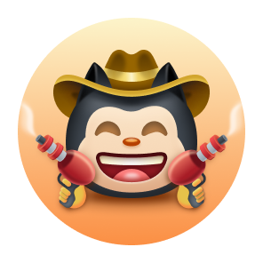

# Conquistas do GitHub

   

# Exibindo Conquistas

#### Exibir conquistas em seu perfil é totalmente opcional; por padrão, elas podem ser vistas por qualquer pessoa que acessar seu perfil público.  
#### Você pode optar por não exibir conquistas no seu perfil acessando as [configurações do perfil](https://github.com/settings).

# Lista de Conquistas

| Badge | Nome | Como obter | Quantidade necessária |
| :-: | :-: | :-: | :-: |
|  | Heart On Your Sleeve | (???) | PADRÃO / BRONZE / PRATA / OURO |
|  | Open Sourcerer | (???) | PADRÃO / BRONZE / PRATA / OURO |
|  | Starstruck | Criou um repositório que tem muitas estrelas | PADRÃO: 16 ✨ / BRONZE: 128 ✨ / PRATA: 512 ✨ / OURO: 4096 ✨ |
|  | Quickdraw | Gitty up! (fechou uma issue ou pull request em até 5 min após abri-la) | PADRÃO: 1 |
|  | Pair Extraordinaire | Commits coautores em pull request mesclada | PADRÃO: 1 / BRONZE: 10 / PRATA: 24 / OURO: 48 |
|  | Pull Shark | Abriu uma pull request que foi mesclada | PADRÃO: 2 / BRONZE: 16 / PRATA: 128 / OURO: 1024 |
|  | Galaxy Brain | Respondeu a uma discussão (recebeu uma resposta aceita) | PADRÃO: 2 / BRONZE: 8 / PRATA: 16 / OURO: 32 |
|  | YOLO | Mesclou uma pull request sem review | PADRÃO: 1 |
|  | Public Sponsor | Patrocinou um contribuinte de código aberto via [GitHub Sponsors](https://github.com/sponsors) | PADRÃO: 1 |  

# Tom de Pele das Conquistas

#### A aparência de algumas conquistas depende da sua preferência de tom de pele dos emojis.  
#### Você pode alterar seu tom de pele preferido acessando as [configurações de aparência](https://github.com/settings/appearance).

| Badge | Nome | Versões de Tom de Pele |
| :-: | :-: | :-: |
|  | Starstruck |       |
|  | Quickdraw |       |  

# ✨ Conquistas em Destaque ✨

| Badge | Nome | Como obter |
| :-: | :-: | :-: |
|   | Pro | Use o [GitHub Pro](https://docs.github.com/en/get-started/learning-about-github/githubs-products#github-pro) |
|   | Developer Program Member | Seja um membro registrado do [GitHub Developer Program](https://docs.github.com/en/developers/overview/github-developer-program) |
|   | Security Bug Bounty Hunter | Ajudou a caçar vulnerabilidades de segurança no [GitHub Security](https://bounty.github.com/) |
|   | GitHub Campus Expert | Participe do [GitHub Campus Program](https://education.github.com/experts) |
|   | Security advisory credit | Tenha seu alerta de segurança enviado ao [GitHub Advisory Database](https://github.com/advisories) aceito |  

# ❌ Conquistas não mais obtíveis ❌

| Badge | Nome | Como obter | Quantidade necessária |
| :-: | :-: | :-: | :-: |
|  | Mars 2020 Contributor | Contribuiu com código para um repositório usado na [Missão do Helicóptero Marte 2020](https://github.com/readme/featured/nasa-ingenuity-helicopter) | PADRÃO: 1 |
|  | Arctic Code Vault Contributor | Contribuiu com código para um repositório no [Programa de Arquivo do GitHub 2020](https://archiveprogram.github.com/) | PADRÃO: 1 |  

# ℹ️ Mais informações ℹ️

#### Você pode encontrar mais informações sobre as Conquistas do GitHub neste [link](https://docs.github.com/en/account-and-profile/setting-up-and-managing-your-github-profile/customizing-your-profile/personalizing-your-profile#displaying-badges-on-your-profile).

####  

