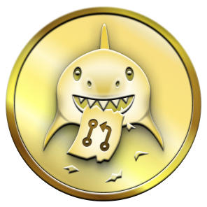
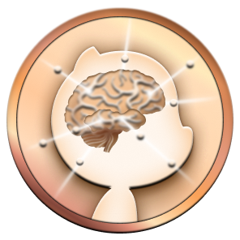
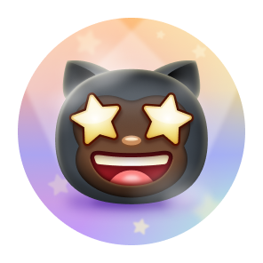

  
  <h1 align="center">🏆 Selos GitHub 🏆</h1>

## 🔍 Exibindo Selos

Por padrão, todos os badges aparecem no seu perfil público.  
Para esconder os selos, visite suas <a href="https://github.com/settings">Configurações de Perfil</a> e desative “Selos”.

> 💡 <em>Dica:</em> Use seus badges como “cartão de visitas” para mostrar contribuições e engajamento!

---

## 🌟 Selos Básicos

|                                                     Badge                                                     | Nome                     | Detalhes                                                        | Níveis                                                                                                                                                                                                                                                                                                                                                                                                                                                                                                                                                                                                                                                                                                                                                                                                                                                                                                                                                                                                                   |
| :-----------------------------------------------------------------------------------------------------------: | :----------------------- | :-------------------------------------------------------------- | :----------------------------------------------------------------------------------------------------------------------------------------------------------------------------------------------------------------------------------------------------------------------------------------------------------------------------------------------------------------------------------------------------------------------------------------------------------------------------------------------------------------------------------------------------------------------------------------------------------------------------------------------------------------------------------------------------------------------------------------------------------------------------------------------------------------------------------------------------------------------------------------------------------------------------------------------------------------------------------------------------------------------- |
|  | **Heart on Your Sleeve** | _detalhes ainda não documentados_                               | 
  
                                                                                                                                                                                |
|                  | **Open Sourcerer**       | _detalhes ainda não documentados_                               | 
  
                                                                                                                                                                                                                        |
|       | **Starstruck**           | _criou um repositório com muitas estrelas_                      | 
 <strong style="font-size: 18px;">16 ✨</strong><strong style="font-size: 18px;">128 ✨</strong><strong style="font-size: 18px;">512 ✨</strong><strong style="font-size: 18px;">4096 ✨</strong> 
                           |
|          | **Quickdraw**            | _fechou uma issue ou PR (Pull Request) em até 5 minutos_        | 
 <strong style="font-size: 18px;">1</strong> 
                                                                                                                                                                                                                                                                                                                                                                                                                                                                                                                                                                                                                                                                                                                                 |
|   | **Pair Extraordinaire**  | _commits de coautoria em PR mesclada_                           | 
 <strong style="font-size: 18px;">1</strong><strong style="font-size: 18px;">10</strong><strong style="font-size: 18px;">24</strong><strong style="font-size: 18px;">48</strong> 
 |
|                              | **Pull Shark**           | _abriu uma PR que foi mesclada_                                 | 
 <strong style="font-size: 18px;">2</strong><strong style="font-size: 18px;">16</strong><strong style="font-size: 18px;">128</strong><strong style="font-size: 18px;">1024</strong> 
                                                                      |
|                        | **Galaxy Brain**         | _resposta aceita em discussão_                                  | 
 <strong style="font-size: 18px;">2</strong><strong style="font-size: 18px;">8</strong><strong style="font-size: 18px;">16</strong><strong style="font-size: 18px;">32</strong> 
                                                          |
|                                         | **YOLO**                 | _mesclou PR sem revisão_                                        | 
 <strong style="font-size: 18px;">1</strong> 
                                                                                                                                                                                                                                                                                                                                                                                                                                                                                                                                                                                                                                                                                                                                                           |
|             | **Public Sponsor**       | _patrocinar via [GitHub Sponsors](https://github.com/sponsors)_ | 
  
                                                                                                                                                                                                                                                                                                                                                                                                                                                                                                                                                                                                                                                                                                                                                                                    |

---

## ✨ Selos em Destaque

| Badge                                                                                                                                                              | Nome                                        | Como obter                                                                                                                            |
| :----------------------------------------------------------------------------------------------------------------------------------------------------------------- | :------------------------------------------ | :------------------------------------------------------------------------------------------------------------------------------------ |
|                                                         | <strong>Pro</strong>                        | <em>assinar <a href="https://docs.github.com/en/get-started/learning-about-github/githubs-products#github-pro">GitHub Pro</a></em>    |
|          | <strong>Developer Program Member</strong>   | <em>ser membro do <a href="https://docs.github.com/en/developers/overview/github-developer-program">GitHub Developer Program</a></em> |
|  | <strong>Security Bug Bounty Hunter</strong> | <em>ajudar a encontrar vulnerabilidades no <a href="https://bounty.github.com/">GitHub Security</a></em>                              |
|                           | <strong>Campus Expert</strong>              | <em>participar do <a href="https://education.github.com/experts">GitHub Campus Program</a></em>                                       |
|                 | <strong>Advisory Credit</strong>            | <em>ter advisory aceito no <a href="https://github.com/advisories">GitHub Advisory Database</a></em>                                  |

---

## 🎨 Variações de Tom de Pele

| Badge                                                                                                    | Nome                        | Variantes                                                                                                                                                                                                                                                                                                                                                                                                                                                                                                                                                                                                               |
| :------------------------------------------------------------------------------------------------------- | :-------------------------- | :---------------------------------------------------------------------------------------------------------------------------------------------------------------------------------------------------------------------------------------------------------------------------------------------------------------------------------------------------------------------------------------------------------------------------------------------------------------------------------------------------------------------------------------------------------------------------------------------------------------------- |
|  | <strong>Starstruck</strong> |       |
|     | <strong>Quickdraw</strong>  |                   |

> ❓ **Como alterar o tom de pele dos selos:**
>
> 1. Clique na sua foto de perfil (canto superior direito) e escolha **Settings**.
> 2. No menu lateral, acesse **Appearance**.
> 3. Em **Emoji skin tone**, selecione o tom desejado.
> 4. Pronto! Qualquer selo que use 👋 mudará automaticamente para o tom escolhido.

---

## 🚫 Selos Descontinuados

|                                                                    Badge                                                                    | Nome                              | Como obter                                                                                       | Quantidade                                                                                                                                                                                                                                                                                                                     |
| :-----------------------------------------------------------------------------------------------------------------------------------------: | :-------------------------------- | :----------------------------------------------------------------------------------------------- | :----------------------------------------------------------------------------------------------------------------------------------------------------------------------------------------------------------------------------------------------------------------------------------------------------------------------------- |
|                       | **Mars 2020 Contributor**         | _contribuiu na [Missão Mars 2020](https://github.com/readme/featured/nasa-ingenuity-helicopter)_ | 
<strong style="font-size: 18px;">1</strong>
                      |
|  | **Arctic Code Vault Contributor** | _contribuiu no [Programa de Arquivo 2020](https://archiveprogram.github.com/)_                   | 
<strong style="font-size: 18px;">1</strong>
 |

---

## ℹ️ Mais Informações

Para detalhes completos e personalização de perfil, visite:  
🔗 <a href="https://docs.github.com/en/account-and-profile/setting-up-and-managing-your-github-profile/customizing-your-profile/personalizing-your-profile#displaying-badges-on-your-profile">GitHub Docs – Exibindo badges no perfil</a>

---

  Seja um <strong>Badge Master</strong> e mostre ao mundo suas conquistas! 🚀

